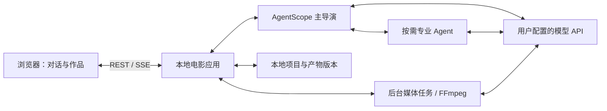

<p align="center"></p>

# Movie Agent

**让一个想法，成为一段电影。**

Movie Agent 是一个在 Windows 本地运行的电影创作 Agent。你用自然语言描述想法，与导演讨论故事、修改剧本，再生成参考图、镜头和声音，合成可以继续修改的短片。目标是让没有 AIGC 制作经验的人，也能参与一部 90–120 秒电影的创作；当前开发以科幻短片为主。

**当前版本：开发预览版。** 已接入真实模型与媒体制作链路，仍在改进故事逻辑、参考资产完整性和托管判断。已有开发影片和修改记录，但尚未完成两种模式各一部影片的完整验收，也不保证一次生成就得到满意成片。

[快速开始](#快速开始windows) · [使用指南](docs/runtime-guide.md) · [设计与架构](DESIGN.md) · [验证记录](docs/validation/runtime-evidence-2026-09-06.md) · [版本下载](https://github.com/LittleNuB/movie-agent/releases) · [MIT 许可证](LICENSE)

## 你可以做什么

- **从对话开始创作。** 先明确故事意图，再生成提案、剧本和制作说明；不要求先准备一套素材。
- **选择共创或托管。** 共创在关键产物处等待审核；托管在已授权范围内推进。制作中仍可插话、提出修改或中止。
- **手动改稿。** 在侧栏编辑剧本，保存草稿与提交修改分开。提交后由导演理解修改，再按具体方案和授权执行。
- **制作参考与镜头。** 管理人物、场景和道具参考，组织镜头输入，调用图片、视频与配音接口；可先用静态构图和临时声音合成分镜预演。
- **看见执行过程。** 对话展示回复与产物入口，运行记录展示模型请求、工具活动、专业协作、媒体任务及失败原因。
- **集中查看作品。** 每个电影对话有独立资产库，收纳文稿、参考图、视频镜头、声音、预演、成片与历史版本；右侧多标签切换查看。
- **反馈后继续修改。** 对视频按时间点标注，单条或批量发送；保留历史版本，支持复用画面修改声音或局部补拍。

当前界面采用左侧项目、中间对话、右侧作品页，支持日间、夜间和跟随系统；品牌标志为 03「显影」。它是对话创作工作区，尚未提供完整的视频时间线编辑器。

## 快速开始（Windows）

需要 Windows、[uv](https://docs.astral.sh/uv/getting-started/installation/) 和可访问依赖源及所选模型服务的网络。项目使用 **Python 3.12**；`uv` 可以按项目约束安装所需版本。使用 Git 克隆，或从 [Releases](https://github.com/LittleNuB/movie-agent/releases) 下载源码 ZIP 后解压。

```powershell
git clone https://github.com/LittleNuB/movie-agent.git
cd movie-agent

powershell -NoProfile -ExecutionPolicy Bypass -File .\scripts\setup.ps1
powershell -NoProfile -ExecutionPolicy Bypass -File .\scripts\start.ps1
```

打开 **http://127.0.0.1:4318**，保持启动终端运行。

初始化按 `uv.lock` 安装 Python 依赖。若本机没有 FFmpeg，会下载 Gyan 的 Windows 构建、核对 SHA256 并保留随包许可；已有 FFmpeg 时需同时提供 `ffprobe.exe`。完整说明见[运行指南](docs/runtime-guide.md)。此源码版本不需要 Node.js，也没有前端构建步骤。

端口被占用时可换一个端口：

```powershell
powershell -NoProfile -ExecutionPolicy Bypass -File .\scripts\start.ps1 -Port 4319
```

### 配置自己的模型

首次启动的服务连接、模型和用途均为空。API 费用由你所配置的服务商账户承担。

1. 打开「模型设置」，添加服务连接，填写**协议类型、Base URL 和 API Key**。
2. 保存后检查连接，按服务商提供的模型 ID 添加模型；支持发现的接口也可获取模型列表。
3. 将模型分配给导演、视觉检查、图片、视频、配音等用途。可以先只配导演体验对话；缺少媒体配置时，相应制作步骤会等待配置。
4. 新建影片，从「我想拍一个……」开始。建议第一次使用共创，先读完故事和结尾，再审核制作。

保存、只读连接检查和实际生成是独立动作。检查成功不代表所有模型都具备生成权限，也不会偷偷生成付费素材。`.env.example` 是历史配置说明，**当前程序不读取 `.env`**，请使用设置页。

| 当前适配的协议 | 已实现的用途 | 使用边界 |
|---|---|---|
| OpenAI 兼容接口 | 导演／专业推理、图片输入检查、文生图 | 服务端需兼容对应协议；导演需要工具调用能力，多模态需模型自身支持 |
| 火山方舟 | 图片生成及参考图输入、视频生成 | 模型 ID、参考方式与参数仍需对应模型支持 |
| MiniMax 视频 V2 | 文本、首尾帧或参考媒体生成视频 | 适配已有 H3 系列路径，不代表兼容所有视频接口 |
| MiniMax 声音 V1 | 系统音色配音、纯音乐请求 | 配音有真实产物；配乐尚无成功产物，见下方验证状态 |
| 其他接口 | 设置可记录连接 | 尚未适配生成协议，不能仅靠填写模型 ID 获得兼容 |

本版本的实现限制为 **MiniMax 视频 768P、方舟视频 720P，成片导出 1280×720、16:9、24 fps、48 kHz 音频**。已有高分辨率源文件会保留，导出时本地转换。这些分辨率目前由程序校验；模型选择由用户配置，产品不预填开发者的模型组合。

## 真实完成度与已知限制

| 范围 | 当前证据 |
|---|---|
| 对话与制作工具 | AgentScope 对话、流式工具回传、SQL 会话、收件箱、后台媒体任务和前端事件已有实现与分项验证 |
| 真实模型接入 | 开发中取得过 GLM 流式工具及图片输入结果、Seedream 图片、H3 视频和 MiniMax 配音；不代表其他账号或模型自动可用 |
| 前期制作 | 制作说明、参考关系、镜头输入编译与有声分镜预演已有实现；两组真实文字验证及 8 秒预演有产物，仍发现参考遗漏和故事逻辑问题 |
| 完整影片与修改 | 开发中产出过《回声频率》91 秒影片和结尾修改版本，包含 Codex／开发者在产品外的操作；不能作为全程自主托管成功的证据 |
| 人工评价 | 首轮影片被反馈为无聊、价值不明确、故事看不懂，故事人评未通过；视觉、连续性和修改质量仍需继续核对 |
| 独立配乐 | 已实现 `music-3.0` 请求，但开发验证账号收到 HTTP 410，尚无成功产物；不能宣称独立配乐链路已跑通 |
| 稳定性与交付 | 自动化控制测试、部分真实调用和浏览器检查已执行；21 个场景族、共创／托管各一部影片及各自修改的完整验收尚未完成 |

生成结果依赖剧本细节、参考资产、模型能力和人工判断。约 30 分钟得到首条可看片、成本预期和参考电影的质感都是开发目标，没有作为产品承诺或预算硬停止规则。分镜预演由静态图和声音合成，不等于真实视频试拍。

具体问题与证据见[用户反馈](docs/validation/feedback-round-2026-09-08.md)、[前期制作真实验证](docs/validation/preproduction-live-2026-09-09.md)、[首轮验证矩阵](docs/validation/first-round-matrix.md)和[本次发布检查](docs/validation/public-release-2026-09-09.md)。历史研究保留原日期；价格、模型可用性及研究结论不作为当前服务保证。

## 运行方式与数据

浏览器通过同源 REST 和 SSE 连接本地 FastAPI 服务。主导演持续对接用户，按需委派视觉、后期和检查职责；媒体任务由后台执行，完成后通知导演并更新界面。AgentScope 管理 Agent 协作和会话，电影应用管理版本、授权、任务恢复和 FFmpeg 合成。



- 默认项目数据位于 `local-data/`，包含电影数据库、AgentScope 会话和生成文件；备份前先停止服务，再备份整个目录。
- API Key 保存在当前 Windows 用户的凭据管理器，页面不回读旧 Key。源码包不含开发者 Key、个人配置、会话数据库或实际生成影片；验证文档中提到的本地产物不会随下载出现。
- 模型推理和媒体生成会将必要文本与参考内容发送到你配置的 API 服务。项目在本机保存，不等于全部离线运行。
- 关闭浏览器不会停止仍在运行的本地服务；停止服务、电脑关机或休眠会影响本地调度。已取得任务身份的云端任务可在重启后继续查询。
- 「中止」会阻止后续调度并停止本地执行。已经提交的云端任务可能继续计费；H3 默认不调用兼具删除语义的取消接口，迟到结果保留为候选。
- 本地服务只监听回环地址，目前面向个人使用，不提供多人账号、服务器公网部署或安装包。

## 开发与文档

| 路径 | 内容 |
|---|---|
| `src/movie_agent/` | Agent、电影工具、API、Provider、版本存储、任务与合成 |
| `web/` | 真实运行界面，原生 JavaScript / CSS |
| `scripts/` | Windows 初始化、启动与本地验证数据导出 |
| `tests/` | 授权、版本冲突、恢复、媒体和界面文本等自动化检查 |
| `docs/` | 产品、架构、决策、研究与实际验证记录 |
| `prototype/` | 早期模拟交互原型，不调用真实模型 |
| `third_party/` | 改写来源和第三方许可声明 |

开发检查：

```powershell
uv run --frozen ruff check src tests
uv run --frozen pytest -q
node --test tests/test_workspace_markdown.mjs
```

最后一条需要 Node.js（开发验证使用 Node 24）。FFmpeg 相关测试需要可用的本地媒体工具；这些测试不证明模型质量或完整电影验收通过。

`main` 为当前公开代码，`feat/movie-runtime` 用于持续实现；`prototype/film-creation` 保留早期交互参照。仅体验旧原型时可运行 `npm run dev` 并打开 4317 端口，其示例回复和 Canvas 影片均为模拟内容。

阅读入口：[文档索引](docs/README.md)、[技术基线](docs/architecture/technical-baseline.md)、[统一术语](CONTEXT.md)、[开发助手规则](AGENTS.md)、[贡献说明](CONTRIBUTING.md)、[变更记录](CHANGELOG.md)。下一步继续完善资产与作品页的视觉体验、剧本因果与参考工程，并用真实创作和人评核对托管质量。

## 来源与许可

项目以 [MIT](LICENSE) 许可开源。ViMax 固定版本的故事、分镜及参考选择方法经改写后用于电影提示，保留[具体来源、改写说明与原许可](third_party/README.md)。AdCraft、OpenMontage 是研究参考，未引入它们的整套运行时。AgentScope、FFmpeg 及其他依赖继续适用各自许可。

本次发行是**源码预览包**，不包含模型权重、API 服务权限、依赖环境、FFmpeg 二进制或开发者生成的影片。模型服务及生成内容的使用条件以相应服务和内容权利为准。
