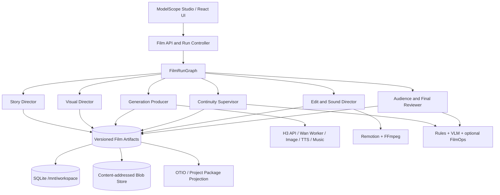

> 历史材料：迁自旧工作区。保留当时的判断与验证范围；其中被后续决定取代的内容不得作为新项目指令。迁移仅增加此提示并修复本地链接，来源见[迁移记录](../../provenance/source-migration.md)。

> 历史快照：2026-09-05 归档的早期候选报告，含已被后续决定替代的假设。当前材料见[文档入口](../../README.md)。

# 科幻电影导演 Agent 技术方案报告

**项目：** digital-human-agent-mvp 竞赛版 v0.5 候选架构
**日期：** 2026-09-04
**状态：** 技术讨论稿，不代表已授权修改代码、调用模型、部署或公开仓库

> **后续讨论提示 · 2026-09-05：** 本文为早期候选方案，尚未完整同步后续决定。当前目标时长已调整为 90–120 秒；必须保留旧工程、自研运行图及固定角色数量等假设不能视为定案。首次故事提案的产品结构见[已确认记录](../../product/creative-interaction.md)，它不代表技术架构已选定。

## 所有者校正 · 2026-09-04

60–90 秒已获接受。单主角、单空间、单异常被明确否决为产品边界，只能用于一个低复杂度测试用例。固定镜头数、少对白和单一节拍顺序也不能沿用为已批准假设。下文架构、角色分工和模型均是候选，须针对待确认的多样科幻创作任务重新验证；本次只修正文档，不实现新合同。

## 1. 技术结论

建议采用「领域层重构、基础设施保留」：冻结 v0.4 以 `PrimaryVideo`、三套模板和 `FirstCut` 为中心的制作路径，新建独立的电影领域模块与显式多 Agent 运行图；通过端口适配现有 Blob、不可变版本、恢复检查点、Provider 调用、成本、审查、Remotion/FFmpeg 和项目包能力。

不建议立即把整个项目迁移到 AgentScope、LangGraph Python 或 Google ADK。现有 TypeScript 系统已经拥有这些框架最难补的部分：持久状态、未知调用恢复、版本/分支、真实媒体与可撤销发布。为了框架名重写会同时引入 Python/Node 双状态、部署和回归风险。

建议实现一个小而显式的 `FilmRunGraph`。图负责节点、依赖、并行、回边预算和停止条件；每个 Agent 只读所需的结构化产物并输出严格 Schema；数据库和媒体状态继续由一个事务层管理。如果后续选择 LangGraph JS，它必须替换而不是包裹运行图的持久化，避免双重真相源。

## 2. 现状评估

### 2.1 可复用基础

| 能力 | 当前证据 | v0.5 处理 |
|---|---|---|
| 本地 Pi Agent 与工具循环 | `server/v2/local-pi-creative-agent.ts` | 仅用于可信本地创作/代码修复模式，不进入公共 Studio 默认运行时 |
| 本地制作工作区与检查点 | `server/v2/local-creative-workspace.ts` | 通过 `CreativeWorkspacePort` 复用，用于 Remotion 与媒体构建 |
| 持久运行、ProviderAttempt、恢复 | `server/v2/runtime.ts` | 抽取为小端口，不让新图继续写入 2813 行单体运行时 |
| 项目仓储、不可变版本与分支 | `server/v2/project-repository.ts` | 通过 `FilmRepositoryPort` 复用事务与身份，不复用旧领域命名 |
| 严格创作计划合同 | `shared/creative-plan-contract.ts` | 借鉴 TypeBox 严格 Schema 方式，新建电影合同 |
| 可撤销编辑操作 | `shared/edit-patch-contract.ts` | 保留精确范围、父版本和影响计算；扩展为电影剪辑补丁 |
| 审查包与决定 | `shared/review-contract.ts` | 扩展为镜头、相邻镜头、整片三类审查包 |
| 运行成本与指标 | `shared/creative-run-metrics.ts` | 扩展生成秒数、候选数、重生率、GPU/Provider 与每镜费用 |
| Remotion/FFmpeg 渲染 | `remotion/`、`server/services/ffmpeg.ts` | 继续用于字幕、图形、时间线合成、转码与 QC |
| 素材内容身份与权利 | `server/v2/blob-store.ts`、`project-asset-license.ts` | 复用；增加生成模型、提示、参考与许可回执 |
| 项目包 | `server/v2/project-package.ts` | 复用完整性与重新准入；增加 FilmManifest/OTIO/模型清单 |

### 2.2 不应继续扩展的部分

- `FIRST_CUT_TEMPLATE_PLANS` 只接受三套固定模板，证明当前生成入口仍是口播模板合同。
- 首版制作把仓库模板复制进工作区，只要求一个 before/after 静帧检查；这不能承担跨镜电影质量。
- `runtime.ts` 与 `project-repository.ts` 分别超过 2800/3000 行，继续加入电影对象会扩大耦合和恢复风险。
- `PrimaryVideo` 是旧项目事实，不应成为一句话电影项目的根实体。
- 模板确认是 v0.4 的产品门，不适合比赛的无人工「统一一句话生成测试」。

## 3. 目标架构



### 3.1 部署拓扑

```mermaid
flowchart LR
  BROWSER[评委浏览器] --> STUDIO[ModelScope Studio Docker<br/>Node API + React + lightweight render]
  STUDIO --> H3[MiniMax H3 API]
  STUDIO --> OBJ[Provider URLs / optional OSS]
  STUDIO --> DATA[/mnt/workspace<br/>SQLite + local blobs]
  DEV[可信本地开发模式] --> SPARK[DGX Spark ARM64 Worker<br/>ComfyUI + Wan/Hunyuan]
  STUDIO -. optional provider adapter .-> SPARK
```

比赛交付的默认实时路径使用 H3 API，使创空间不依赖独占 GPU。DGX Spark 是可选本地/云协同证明；若没有稳定可访问的 Worker，不应成为公开 Demo 的必经路径。

## 4. 新领域模型

旧 `VideoProject` 保持不变。新建 `FilmProject`，避免静默迁移历史项目。

| 对象 | 作用 | 关键字段 |
|---|---|---|
| `FilmBrief` | 冻结用户一句话与硬约束 | premise、durationRange、aspect、language、contentPolicy、seed |
| `StoryBlueprint` | 不预设剧本类型的故事合同候选 | intent、characters[]、characterRelations[]、worldRules[]、events[]、plotRelations[]、narrativeOrder[]、constraints |
| `WorldBible` | 多实体、跨场景与跨镜状态候选 | characters[]、locations[]、props[]、entityStates[]、stateRelations[]、visualStyle、audioMotifs[]、referenceAssetIds |
| `ScenePlan` | 同一时空与叙事目标的镜头组 | sceneId、objective、stateBefore、stateAfter、shots |
| `ShotPlan` | 成片镜头意图，独立于单次模型调用 | narrativeDuty、duration、participants[]、actionPlan、shotScale、angle、composition、cameraMotion、dialogueOrVo、continuityState |
| `GenerationSpec` | 与 Provider 无关的生成意图 | first/lastFrame、references、motion、negativeConstraints、audioIntent、candidatePolicy |
| `ProviderRequest` | 特定模型编译结果 | provider、model、payloadHash、idempotencyKey、estimatedCost |
| `ShotCandidate` | 不可变生成候选 | mediaAssetId、providerTaskId、seed、promptVersion、cost、qcReceipts |
| `ContinuityIssue` | 可定位的跨镜失败 | leftShotId、rightShotId、dimension、evidence、severity、repairTarget |
| `RoughCut` | 首条完整时间线 | orderedCandidates、trim、transitions、tempAudio、duration |
| `PictureLock` | 已确认画面结构 | timelineHash、lockedShotVersions、reviewReceipt |
| `SoundPlan` | 多层声音合同 | sceneBeds、musicCues、voiceCues、foleyAndSfx、mixTargets |
| `FilmManifest` | 最终内部真相源 | video/audio/text tracks、assets、effects、captions、lineage |
| `FilmVersion` | 不可变用户版本 | parentId、manifestHash、instruction、provenance、status |
| `FilmReviewPacket` | 可见审查证据 | scope、frames/clips/audio、checks、findings、decision |

所有对象都带 `schemaVersion`、稳定 ID、创建时间、输入产物哈希和父版本。Provider 不能直接写这些对象，只能返回候选结果，由运行时校验并提交。

人物、场景和世界规则使用集合与关系表达，不设置隐含的“必须且只能有一个”。这只是解除错误单数假设的设计修正，尚未构成完整 Schema 或已实现能力。模型参考数量、显存、生成时长等限制应放到 Provider 能力与任务执行计划中。

### 4.1 连续状态

`WorldBible` 不能只存一段人物描述。每个镜头显式携带：

- 角色外观、服装、姿态、朝向、情绪与是否可见；
- 关键道具的位置、状态与变化；
- 空间、时段、光源、色温与天气；
- 镜头开始/结束的动作状态；
- 需要从上一镜继承的参考图、末帧或声音。

连续性检查须按故事时空和实体关系比较状态，覆盖相邻镜头、跨场景再次出现及并行/非线性叙事的相关镜头。`stateAfter(left)` 与 `stateBefore(right)` 只适用于剧情上连续的片段；合法换景、时间跳跃和设定变化不能自动判为错误。具体关系合同仍待讨论。

## 5. FilmRunGraph

### 5.1 主状态机

```text
created
  → story_planning
  → world_bible
  → shot_planning
  → anchor_generation
  → shot_generation
  → rough_cut
  → continuity_review
  → fine_cut
  → sound_mix
  → final_review
  → completed
```

任一可恢复阶段可进入 `paused`；明确不可恢复错误进入 `failed`；用户停止进入 `discarded`；质量检查可沿预定义回边返回 `story_planning`、`shot_planning`、`anchor_generation`、单个 `shot_generation` 或 `fine_cut`。

### 5.2 节点合同

每个图节点实现统一接口：

```ts
type FilmNode<I, O> = {
  id: FilmNodeId;
  inputSchema: TSchema;
  outputSchema: TSchema;
  requiredArtifactKinds: string[];
  run(input: I, context: FilmNodeContext): Promise<NodeResult<O>>;
  classifyFailure(error: unknown): FailureDisposition;
};
```

`NodeResult` 只包含结构化产物、工具回执、评估回执和下一步建议。模型的自由文本可留作调试摘要，但不能驱动状态提交。

### 5.3 有界回路

| 回路 | 最大预算 | 触发 | 最小回退目标 |
|---|---:|---|---|
| 故事可拍性 | 2 | 因果不完整、超出生成约束 | `StoryBlueprint` |
| 镜头可生成性 | 2 | 当前模型无法满足动作/交互/文字/声音时长，需拆解或换执行策略 | 相关 `GenerationSpec`，保持 `ShotPlan` 创作意图 |
| 关键锚点 | 2 个候选 | 角色/空间/道具不稳定 | 单一锚点资产 |
| 普通镜头 | 1 次修复 | 技术/安全/严重画面失败 | 单镜 `GenerationSpec` |
| 高风险镜头 | 2 次修复 | 表演、揭示或身份失败 | 单镜候选 |
| 跨镜连续 | 每对 1 次 | 人物/道具/空间/声音跳变 | 右镜优先，必要时两镜 |
| 粗剪结构 | 1 次 | 故事或节奏断裂 | `RoughCut` / 部分镜头计划 |
| 技术 QC | 直到通过或硬失败 | 编码、黑帧、削波等 | 合成/转码，不重生内容 |

MAViS 的消融支持 Explore–Examine–Enhance，但其完整流程平均需要大量算力；本方案只把候选和迭代用在高风险处，并以预算耗尽作为合法终止状态。[MAViS](https://aclanthology.org/2026.eacl-long.101/)

### 5.4 失败分类

- `validation`: Agent 输出不符合 Schema；同一节点最多修复一次，仍失败则停止。
- `provider_transient`: 429/5xx/网络中断；指数退避并保留 Provider task ID。
- `provider_rejected`: 内容或参数被拒；由提示编译器局部修正，不能原样重试。
- `provider_unknown`: 提交后响应不明；先查询任务，不创建重复任务。
- `quality_repairable`: 候选可解码但未过质量门；生成 `RepairDirective`。
- `quality_blocking`: 多轮仍失败；输出诊断和可播放的最后合格版本，不伪装完成。
- `user_action_required`: 预算、授权、敏感素材或公开动作；暂停等待。

这沿用当前仓库 ProviderAttempt 和恢复原则，也符合多 Agent 失败研究对明确规范、验证与终止的要求。[多 Agent 失败研究](https://arxiv.org/abs/2503.13657)

## 6. Agent 与上下文

### 6.1 角色合同

1. **StoryDirectorAgent**
   输入 `FilmBrief`；输出 `StoryBlueprint`。检查创作意图、人物/实体关系、科幻规则、事件组织与目标时长，不强制单一异常或“选择—反转”结构。

2. **VisualDirectorAgent**
   输入故事蓝图和适用的电影知识；输出 `WorldBible + ScenePlan[] + ShotPlan[]`。摄影、表演与剪辑方法根据故事选择；复杂动作可拆为多个生成片段，但不得静默删减人物或剧情。

3. **GenerationProducerAgent**
   输入镜头计划、锚点和预算；输出与 Provider 无关的 `GenerationSpec[]`、并发计划和候选策略。实际调用由类型化工具完成。

4. **ContinuitySupervisorAgent**
   输入具有剧情或实体连续关系的镜头状态、候选帧/短片与声音摘要；输出 `ContinuityIssue[]` 与局部 `RepairDirective[]`，覆盖跨场景和非相邻镜头。

5. **EditSoundDirectorAgent**
   输入合格候选；先输出 `RoughCut`，经审片反馈后输出 `PictureLock + SoundPlan + FilmManifest`。

6. **AudienceReviewerAgent**
   输入整片、故事蓝图和动态检查点；输出带时间范围、证据、置信度和修复目标的审查。它无权直接改成片。

### 6.2 上下文最小化

Agent 不共享完整聊天历史。每个 Agent 只获得：

- 当前冻结用户意图；
- 它需要的上游产物；
- 相关视觉/连续状态；
- 本节点规则与预算；
- 最近一次失败/评估回执。

所有大媒体由工具生成抽帧、联系表、音频统计或短编码片段；模型上下文只传必要证据。Hollywood Town 对分层图、按需上下文与有界回边的研究支持这一方向，但其样本量有限，应通过本项目消融验证。[Hollywood Town](https://arxiv.org/abs/2510.22431)

### 6.3 框架选择

| 方案 | 优点 | 代价 | 结论 |
|---|---|---|---|
| 现有 TS 运行时 + 新 FilmRunGraph | 最大复用、一个状态源、最适合十天 | 需自行做图声明和可视化 | **推荐** |
| LangGraph JS | 图、并行、中断、SQLite Saver 成熟 | 与现有版本/恢复重复；迁移与双写风险 | 仅在它完全接管新图状态时考虑 |
| AgentScope Python | ModelScope 生态、工作流、追踪、评价完整 | Python 重写、媒体与现有 TS 双栈 | 比赛后研究，不进首发 |
| Google ADK JS/Python | Sequential/Parallel/Loop 和轨迹评价清晰 | 生态迁移，无现有资产优势 | 不采用 |

LangGraph 官方文档确认 JS 支持节点检查点、故障恢复、中断和 SQLite Saver；这也是为什么不能再额外套一层自有检查点而不定义真相源。[LangGraph Persistence](https://docs.langchain.com/oss/javascript/langgraph/persistence)

## 7. 模型与工具方案

### 7.1 视频生成

以下排序来自上一版研究，尚未选定。单体镜头能生成不等于多人物互动、多场景和多设定可用；必须以重新确认的测试矩阵复核模型、参考组织、声音能力、费用及降级方案。

| 角色 | 首选 | 回退/实验 | 选择理由 |
|---|---|---|---|
| 竞赛实时主路径 | MiniMax H3 API 768P | H3-Max 仅用于无参考镜头 | 4–15 秒、图/视频/音频多参考、原生立体声音频、异步任务 |
| 本地开放回退 | Wan2.2 TI2V-5B | HunyuanVideo 1.5 | 720P/24fps、约 24GB；Apache-2.0；ModelScope/ComfyUI 路径明确 |
| 后续质量实验 | LTX-2.5 | H3 开放权重 | 原生多镜头音视频，但版本新、32GB+、许可和集成风险较高 |

H3 API 请求体支持文本、首尾帧或多参考模式；最多 9 张参考图、3 段参考视频和 3 段参考音频，参考视频/音频总时长各不超过 15 秒，整个请求体不超过 64MB。生成是异步任务，状态为 queued/running/succeeded/failed/cancelled。[H3 API](https://platform.minimax.io/docs/api-reference/video-generation-v2-create)

实现上默认轮询 Provider task ID。官方 callback 首先要求三秒内回传 challenge，但公开页未展示可验证签名方案；在鉴权机制完整核验前，不把 callback 当作唯一完成信号。

### 7.2 视觉锚点

优先用 Qwen-Image-Edit-2511 或 H3 参考图能力生成三类锚点：

- 人物身份板：正面/侧面、服装轮廓、标志细节；
- 空间板：广角布局、主要光源、关键入口与背景层；
- 道具板：形态、材质、状态变化前后。

每镜头的参考包只传相关锚点，不把所有图堆进每个请求。Qwen-Image-Edit-2511 支持多图和人物一致编辑，Apache-2.0；视觉锚点对跨镜身份稳定的必要性也得到独立研究消融支持。[Qwen-Image-Edit-2511](https://huggingface.co/Qwen/Qwen-Image-Edit-2511) · [Character-Stable AI Video Stories](https://arxiv.org/abs/2512.16954)

### 7.3 语言与规划模型

首发保留 Provider 可替换接口。Qwen3.8-27B 可作为本地/ModelScope 规划候选，支持多模态与 OpenAI 兼容服务，官方权重于 2026 年 8 月发布；当前项目已有 Qwen/Gemini Provider 模型与费用记录，可先复用 API 路径，再做 Qwen3.8 本地探针。[Qwen3.8](https://github.com/QwenLM/Qwen3.8)

同一个基础模型可以扮演多个 Agent，但每个角色必须有独立系统合同、输入裁剪、输出 Schema、评估和成本记录。多模型不是多 Agent 的必要条件。

### 7.4 语音、音乐与声音

- 语音：CosyVoice 3 是旁白/画外音候选；对白、说话人区分、表演与口型同步需单独讨论和测试，不能被默认旁白替代。声音克隆必须获得授权。
- 音乐：ACE-Step 1.5 或明确授权的音乐库；整片 1–2 个主题/氛围 cue，不按镜头生成音乐。
- 环境与动作声：优先使用 H3 原生音频与可追溯 SFX 库；必要时再评估 Woosh 等非商业开放模型。
- 混音：FFmpeg 生成独立对白、环境、音乐、SFX 总线，保留每层源文件和时间码。

FilMaster 将声音拆成场景级环境/配乐、镜头级 VO、镜内拟音/SFX，并指出直接让 MLLM 一次规划所有音轨容易失配。本方案采用同一时间尺度分层。[FilMaster](https://arxiv.org/html/2506.18899)

### 7.5 成本预算

按 2026-09-04 官方价格，H3 768P 为 $0.08/生成秒，2K 为 $0.13/秒，768P→2K 重生为 $0.05/秒。[MiniMax 定价](https://platform.minimax.io/docs/guides/pricing-paygo)

75 秒、按一次基础生成加 30% 定向重生假设的算例：

| 项目 | 估算 |
|---|---:|
| 一次 768P 基础生成 | $6.00 |
| 对 30% 时长定向重生 | $1.80 |
| 全部合格镜头升级 2K | $3.75 |
| 视频生成合计 | 约 $11.55 |

这不含 LLM、图片、TTS、音乐、失败请求和税费。若所有镜头都生成双候选，基础视频成本接近 $12，因此只对揭示、人物表演和结尾等高风险镜头使用双候选。

该算例不是不同复杂度故事的成本承诺。多人物参考、跨场景连续、对白/动作修复会改变参考费用、候选和重生比例，需在新测试矩阵上实测。

## 8. 媒体流水线

### 8.1 生成前

1. 验证 `FilmBrief` 和内容边界。
2. 生成故事蓝图并检查时长可拍性。
3. 建立视觉圣经和人物/空间/道具锚点。
4. 按叙事、表演和剪辑需要确定镜头数与时长；再根据具体 Provider 的单次生成限制拆分请求。8–10 镜只保留为基础用例的可选配置。
5. 为每镜生成 Provider 无关 `GenerationSpec`。
6. 估算总生成秒数、候选数和预算，超过硬上限则在调用前失败。

### 8.2 生成中

- 按场景与依赖关系并行，默认并发可配置为 2；具体并发须在账户限额实测后确定。
- 每个请求使用稳定幂等键：`filmRunId/nodeId/shotId/specHash/attempt`。
- Provider 返回 task ID 后立即持久化，进程中断后先查询原任务。
- 成功 URL 立即下载到临时区，探测、哈希、时长/画幅/音轨校验后写入 Blob Store。
- 远端 URL 只作为来源回执，不作为长期媒体真相源。

### 8.3 镜头评价

每个镜头抽取首、中、末帧和低码率预览，检查：

- 可解码、时长、画幅、音轨；
- 与镜头意图一致；
- 主体/背景/道具与锚点一致；
- 所要求的动作、人物交互和状态变化是否自然完成；
- 肢体/面部/物理异常；
- 镜头尺度、角度、构图、色调和运镜；
- 原生音频是否含意外对白、噪声或不可接受跳变。

自动评价只淘汰明显失败并给出修复方向。FilmBench 显示通用模型容易高估静态清晰画面，电影级薄弱项在动态表演、多镜头和剪辑，因此最终候选不能只按单帧审美分排序。[FilmBench](https://arxiv.org/html/2607.24241v2)

### 8.4 粗剪与精剪

粗剪先确保因果与完整时长，不做重包装。观众审片输出时间范围和问题类别。精剪支持：

- 镜头重排、删除、替换；
- 头尾裁切、轻微变速、停留；
- J/L 声桥、交叉淡化、环境连续；
- 字幕和后期可控屏幕文字；
- 少量有叙事动机的 Remotion 图形；
- 旁白、环境、音乐、SFX 分轨混音。

最终内部 `FilmManifest` 编译成 Remotion/FFmpeg；同时可投影为 OTIO。OTIO 能表达剪辑顺序、时长、轨道、转场、标记和外部媒体引用，但不嵌入媒体，也不能完整表达自定义 Remotion 图形，因此只作为交换格式。[OpenTimelineIO](https://opentimelineio.readthedocs.io/en/latest/)

## 9. 评价系统

### 9.1 检查点层级

| 层级 | 典型检查 | 证据 |
|---|---|---|
| 故事 | 主题忠实、因果、人物选择、结尾 | StoryBlueprint 与脚本 |
| 单镜 | 指令、动作、画质、人物/空间/道具 | 抽帧、短预览、锚点 |
| 跨镜关系 | 人物/场景再次出现、状态、剧情时空、声音与转场 | 有关联的镜头证据、状态图、剪辑顺序与音频 |
| 整片 | 节奏、叙事、声画、吸引力 | 完整低码率影片、时间码 |
| 技术交付 | 编码、时长、黑帧、静音、峰值、字幕 | FFprobe/FFmpeg/QC 回执 |

### 9.2 FilmOps 与 VBench

FilmOps 提供景别、构图、角度、色调、人物布局和镜头运动六类专业算子，代码为 Apache-2.0，但部分权重有额外许可且 InternVL3 算子较重。首发建议：

- 先集成轻量景别、角度、色调算子或离线批处理；
- 人物布局/镜头运动可暂由 VLM + 人工校验；
- 不把 FilmOps 总分作为自动提交门；
- 锁定每个权重的许可证和来源。

[FilmOps](https://github.com/Neo-yk/FilmOps) 可与 [VBench](https://github.com/Vchitect/VBench) 的主体/背景一致、闪烁、运动和审美指标组合，但整片故事和节奏仍需要人评。

### 9.3 消融与评测集

测试集应交叉覆盖科幻叙事与制作复杂度，不能只替换基础用例的主题措辞。单主角/单空间/单异常是一个基础回归用例；多人物互动、多场景衔接、不同设定与叙事形式列入待选测试维度。用例数量、能力范围和保留集在讨论后冻结，不把未做过的测试写成已支持。对可比较条件固定时长、种子策略和预算，比较：

1. 完整多 Agent + 连戏 + 整片审片；
2. 单 Agent + 同一工具；
3. 多 Agent 但去掉局部修复回路。

主要指标：

- E2E 完成率；
- 首次可看时间；
- Provider 成功率与未知调用恢复率；
- 每镜/每分钟成本；
- 镜头候选淘汰和重生比例；
- 故事忠实、叙事连贯；
- 人物/空间/道具一致；
- 动作与物理自然；
- 剪辑、声音、跨镜连续；
- 人类总体偏好和愿意发布比例。

DirectorBench 的五类检查点和跨镜瓶颈结论可用于设计诊断报告；不直接采用其单一权重。[DirectorBench](https://arxiv.org/abs/2605.30090)

## 10. 持久化与可观测性

### 10.1 一个状态真相源

所有运行状态写入同一 SQLite 数据根。ModelScope Studio 的持久路径设为 `/mnt/workspace`。图检查点只保存节点状态、产物引用和下一步，不复制完整媒体。

建议新表/集合：

- `film_projects`
- `film_runs`
- `film_node_attempts`
- `film_artifacts`
- `film_artifact_edges`
- `provider_tasks`
- `shot_candidates`
- `continuity_issues`
- `film_versions`
- `film_review_packets`

当前 `ProjectRepository` 通过适配器完成事务；不要让 Agent 自己写 SQL。

### 10.2 运行轨迹

每个节点至少记录：

- 节点/角色/输入输出 Schema 版本；
- 输入、输出和系统规则哈希；
- 模型、Provider、温度/种子与提示版本；
- 任务 ID、状态、开始/结束/等待时间；
- Token、输入/输出生成秒数、原币费用；
- 工具调用、重试类别、停止原因；
- 评估回执和实际下游决定。

公开 UI 显示精简轨迹；完整轨迹可下载。TraceElephant 的研究说明，完整输入与上下文轨迹能显著改善多 Agent 失败归因，因此只记录最终文字不足以支撑调试。[TraceElephant](https://aclanthology.org/2026.acl-long.912/)

## 11. ModelScope Studio 部署

### 11.1 Studio Docker

当前 React + Express 适合 Docker Studio：

- 多阶段构建前端；
- 运行镜像安装 Node 26、FFmpeg/FFprobe、Chromium 及所需中文字体；
- 服务监听 `0.0.0.0:7860`；
- `DATA_ROOT=/mnt/workspace`；
- Provider Key 只放 Studio Secrets；
- 前端静态文件由同一 Express 服务提供；
- 启动时执行数据库迁移、写权限与 ffmpeg/Chromium 自检；
- `/health/live` 不依赖 Provider，`/health/ready` 验证数据根和必要服务。

ModelScope 官方说明 Docker Studio 必须使用 7860，默认重启会丢失非持久路径，敏感配置应使用 Secrets，超过 100MB 文件使用 LFS；Docker 类型还需要账号绑定和实名认证。[ModelScope Studio 部署](https://modelscope.cn/skills/modelscope/modelscope-studio)

### 11.2 公共运行时安全

Pi 官方明确说明本地 Agent 没有内置沙箱，Shell、扩展和包安装继承进程用户权限。因此：

- 公共 Studio 不加载 `LocalPiCreativeAgent`；
- Agent 只调用 allowlist 类型工具；
- 不提供任意路径、Shell、代码上传或依赖安装；
- 输入先做长度、内容、版权与费用预检；
- 每账户/会话设置并发和生成秒数上限；
- 外部 Provider 响应当作不可信输入，探测后再入库；
- API Key、回调凭证和存储凭证均由 Secrets 注入。

[Pi Security](https://pi.dev/docs/latest/security) 支持把当前 Pi 能力限制在可信本地模式的决定。

### 11.3 DGX Spark Worker

DGX Spark 为 ARM64、128GB 统一内存、CUDA 13，并预装 NVIDIA Docker Runtime。NVIDIA 官方已提供 ComfyUI + Wan/Hunyuan 工作流。[DGX Spark 系统](https://docs.nvidia.com/dgx/dgx-spark/system-overview.html) · [ComfyUI Playbook](https://build.nvidia.com/spark)

建议 Worker 使用独立 Python/ComfyUI 容器，提供内部 `MediaGenerationPort`。技术探针必须验证：

- ARM64 wheels 与自定义 CUDA 扩展；
- FlashAttention/Triton/SageAttention；
- 模型下载和磁盘占用；
- 首帧时间、单镜时延、峰值统一内存；
- 容器重启和中途任务恢复；
- 与 Studio 之间的网络可达性与凭证范围。

没有这些回执时，只能写「计划支持 DGX」，不能写成已经在 DGX 上运行。

## 12. 版权、许可与来源

- 参赛素材必须原创或已获合法授权；作品显著标注 AI 生成。
- 不将受版权保护的电影片段、台词、角色、造型或剧照直接加入 RAG/输出。
- 镜头知识库只保存抽象叙事功能、电影语言标签和自有/公共领域范例。
- 每个生成资产保存模型、精确版本、提示哈希、参考资产、生成时间、输出哈希和许可证快照。
- H3、LTX、Qwen、Wan、Hunyuan、CosyVoice、ACE-Step、FilmOps 的代码和权重许可分别核对，不以仓库顶层许可覆盖所有权重。
- Remotion 对个人、非营利和不超过三人的营利组织提供免费使用，组织规模变化时需复核许可证。[Remotion License](https://github.com/remotion-dev/remotion/blob/main/LICENSE.md)
- 声音克隆必须有可证明同意；首发优先预设合成音色。

## 13. 迁移与公开策略

### 13.1 目录建议

```text
shared/film/
  brief.ts
  story-blueprint.ts
  world-bible.ts
  shot-plan.ts
  generation.ts
  continuity.ts
  manifest.ts
  review.ts

server/film/
  graph/
  agents/
  providers/
  evaluation/
  timeline/
  repository/
  http.ts

client/src/film/
  FilmApp.tsx
  RunGraph.tsx
  ShotList.tsx
  FilmPlayer.tsx

tests/
  film-contracts.test.ts
  film-graph.test.ts
  film-provider-h3.test.ts
  film-continuity.test.ts
  film-e2e-mock.test.ts
```

### 13.2 兼容策略

- v0.1–v0.4 项目继续按原合同打开；
- `FilmProject` 使用新的合同标识；
- 旧项目可显式把已有媒体作为新电影的参考或素材，不原地转换；
- 新电影版本不复用旧 Template/FirstCut 状态；
- 公共参赛镜像只包含 v0.5 必要模块、Mock Provider、示例和许可清单。

### 13.3 新仓库或镜像

推荐建立独立公开竞赛仓库，从私有主仓选择性同步代码。理由：

- 避免暴露历史媒体、机器路径、内部研究和未澄清许可内容；
- 简化评委安装和阅读；
- 允许 Mock 模式不依赖付费 Key；
- README 可以直接围绕比赛评分和复现组织。

私有主仓仍是历史和长期产品真相源。公开镜像的同步过程需要清晰版本和哈希回执。

## 14. 验证计划

### 14.1 测试层级

1. **合同测试**：所有 Agent 输入输出、附加字段拒绝、版本升级。
2. **图测试**：正常路径、并行 join、每条回边、预算耗尽、暂停/恢复、停止。
3. **Provider 合同测试**：H3 请求编译、状态轮询、未知提交、下载与哈希、429/422/500 分类。
4. **Mock E2E**：一句话到最终假媒体、完整轨迹与项目包，全程零付费。
5. **媒体测试**：真实 FFmpeg/Remotion、字幕、分轨、黑帧、静音、编码。
6. **三镜头活体探针**：建立镜头、人物表演、异常揭示；H3 每镜至少三次采样。
7. **完整短片测试**：60–90 秒、重启恢复、局部重生和最终 QC。
8. **Studio 测试**：首次构建、重启、持久化、两个浏览器会话、速率/预算门。
9. **消融人评**：多 Agent、单 Agent、无审片回路三组盲评。

### 14.2 竞赛评分证据

| 评分项 | 必备证据 |
|---|---|
| Harness 30 | 真实运行图、角色 Schema、并行/回边、持久检查点、失败恢复、成本与权限日志 |
| 一句话 25 | 固定外部提示、无确认 E2E、完整影片和成功率 |
| 技术 25 | H3/Wan Provider、锚点一致、VLM/FilmOps 评价、局部修复、云/本地接口 |
| 自主作品 10 | 一部完整科幻短片、粗剪到成片对比、整片人评 |
| 复现部署 10 | 公开仓库、Mock 模式、Docker、Studio URL、安装时间与限制说明 |

## 15. 十天实施切片

以下切片是基于原低复杂度假设的排期估算。新范围确认前不可视为承诺或开工授权；尤其模型探针、连戏、对白、资源与评测工作量需重估。

### Slice 0：决策与红线，9 月 4 日

确认产品承诺、电影边界、预算、公开策略和 Studio/DGX 状态。归档 v0.4 设计候选，不改写历史。

### Slice 1：电影领域与 Mock E2E，9 月 5–6 日

新建 Schema、FilmRunGraph、六个角色的最小合同、Mock Provider、持久运行轨迹和一句话到假成片测试。

### Slice 2：H3 三镜头探针，9 月 7 日

接入异步任务、费用、下载、哈希和三类镜头。若不达线，立即切换 Provider 策略。

### Slice 3：视觉圣经与完整粗剪，9 月 8–9 日

锚点、8–10 镜计划、并行生成、旁白/音乐、Remotion/FFmpeg 粗剪。

### Slice 4：跨镜修复与成片，9 月 10 日

连戏检查、整片审片、局部重生、画面锁定、混音和最终 QC。

### Slice 5：Studio 与公开复现，9 月 11–13 日

Docker 7860、`/mnt/workspace`、Secrets、重启恢复、公开镜像、Mock 模式、创作手记和参赛作品。

### Slice 6：提交缓冲，9 月 14 日

只做最终链接、可访问性、AI 标识、版权清单和提交，不继续增加功能。

## 16. 必须先做的技术探针

1. H3 API：建立、人物、揭示三镜头的成功率、成本、延迟、原生音频和参考一致性。
2. Studio Docker：Node 26 + FFmpeg + Chromium/Remotion 在 7860 的构建与重启。
3. 新旧仓储适配：FilmProject 能否在不修改 v0.4 行为的前提下复用 Blob/版本/指标。
4. 锚点策略：人物/空间/道具参考的最小组合和跨镜漂移。
5. 声音策略：H3 原生环境声与外部旁白/音乐能否分层混合而不互相污染。
6. 公共镜像：从私有仓抽取后能否在 Mock 模式 15 分钟内复现。

以上基础探针不足以证明科幻电影 Agent 的覆盖能力；还需按所有者选择的复杂度追加多人物、跨场景及不同叙事的探针。

## 17. 尚未证实的能力

以下均不能在实施前写成当前能力：

- H3 在本项目故事中能稳定维持人物、空间和声音；
- DGX Spark 已能运行 H3、Wan、FilmOps 或 CosyVoice 的全部路径；
- 魔搭创空间可稳定运行 Remotion/Chromium 长任务；
- 自动评价与专业人评一致；
- OTIO 可无损表达全部 Remotion 效果；
- 公开代码满足比赛对开源程度的最终解释；
- 多 Agent 比同预算单 Agent 质量更高。

这些能力应由探针、测试、消融和外部评审逐项转为证据。
