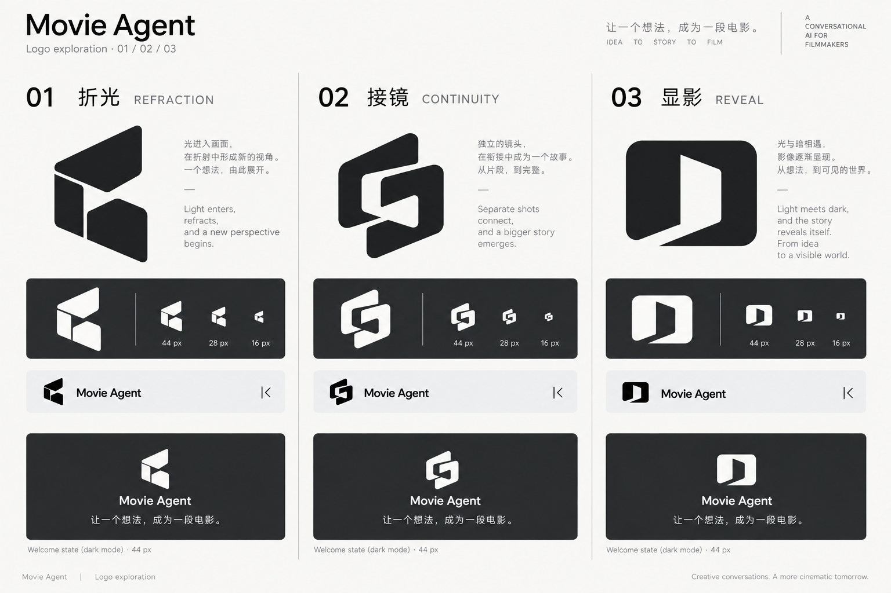

# Movie Agent Logo · 视觉方向探索

日期：2026-09-09。用户要求下一轮优化UI视觉，并指出当前缺少独特Logo。

状态：探索阶段使用Codex内置imagegen生成对照图，未调用产品配置中的媒体Provider。同日用户随后明确选择03「显影」；[SVG接入与验证](../plans/ui-visual-polish.md#03显影接入记录)另记，下文保留三方向比较及原始提示。



| 方向 | 设计意图 | 后续需要核对 |
|---|---|---|
| 01 折光 | 折叠光带和留白形成轮廓，表达想法进入画面 | 小尺寸缝隙和斜面比例，是否容易误读为普通字母 |
| 02 接镜 | 镜头之间的连接与故事连续性 | 链环轮廓是否足够有辨识度，避免常见连接类标志观感 |
| 03 显影 | 开口与光暗关系，表达从想法到可见影像 | 是否容易被理解为门或播放器，电影创作联想是否充分 |

第一轮底色过暗，第二轮保留标志并修正为浅色对照底。图中的16／28／44px为概念排版示意，不算实际像素尺寸和浏览器验收。助手当时倾向01，用户最终选择03，以用户选择为准。

## 生成提示

内置imagegen，首次生成：

```text
Use case: logo-brand.
Create ONE polished brand identity exploration board for the real product "Movie Agent", a conversational AI filmmaking application. This is an original logo concept comparison, not final production artwork. It helps a Chinese product owner choose a design direction for their app.

Product context: an idea becomes a story, coherent shots, sound and a film. A calm, capable creative collaborator, cinematic and precise. Existing UI is a restrained conversational workspace: light grey sidebar, white canvas in day mode; charcoal sidebar and dark graphite canvas in night mode. Keep those two neutral themes. Current placeholder is a plain M in a rounded square; replace it with a distinctive custom symbol.

Landscape board, beautifully restrained Swiss editorial layout, three equal columns separated by hairline rules, generous clear space. Title "Movie Agent" and small subtitle "Logo exploration · 01 / 02 / 03". Exactly three distinct design directions:
01 "折光" / "REFRACTION": a single compact solid folded light ribbon, cut and counterform suggesting light entering a cinematic frame. Confident asymmetric silhouette, controlled diagonal, NOT a literal play triangle or an ordinary letter M. Icon must be memorable in black alone.
02 "接镜" / "CONTINUITY": two interlocking offset frame segments forming one continuous custom knot-like cinematic mark; only two or three bold masses with generous negative space, no tangled thin lines. Express separate shots becoming one story. Distinct silhouette from 01; avoid copying any existing AI knot logos.
03 "显影" / "REVEAL": one substantial rounded rectangular field with a bold off-center open aperture carved out of it, light meeting darkness. Original geometric counterform, editorial and cinematic. NOT a camera iris, eye, sparkle, or stock frame icon. Distinct silhouette from 01 and 02.

For EACH column:
- a large black symbol on near-white with its number and Chinese name;
- same exact symbol reversed in ivory on a charcoal swatch, and a small-size icon row to judge clarity;
- a compact realistic sidebar header snippet with the small symbol at 28 px beside the wordmark "Movie Agent", grey sidebar background, a small navigation collapse icon at the right;
- a restrained dark welcome-state snippet showing the same mark at 44 px above "让一个想法，成为一段电影。" with ample space. These are application context studies, not a redesign into a media dashboard.

Flat, vector-like precision, clean optical balance and stroke/shape consistency. Wordmark is elegant neutral sans-serif, not a futuristic gaming font. Monochrome first; no gradients, glow, textures, metallic rendering, dramatic photographs or decorative mockup objects. Avoid clapperboards, film reels, robot faces, circuit boards, generic play buttons, four-point AI sparkles and the existing plain M badge. Do not mix the three identities inside any one column. Keep all copy short, perfectly legible and aligned. Final should look like a considered identity designer's concept sheet, not a marketing poster.
```

第二轮局部修正：

```text
Edit this logo exploration board. Preserve ALL THREE existing logo designs exactly, including the white versions, wordmarks, columns, samples, labels and placement. Change only the presentation surface for legibility:
Make the entire board backdrop a completely flat, opaque, uniform warm white #F8F8F5, from edge to edge. Remove every smoky grey texture, vignette, spotlight, background gradient, dark cloudy overlay, glow and shadow. The large three black logo marks and black headings must be crisp and clearly visible against this white backdrop. Body explanation text must be solid medium grey #636868, not pale grey; column separator rules light grey. Keep the existing charcoal rectangular swatches and dark welcome panels dark with clear ivory icons and copy. Keep the sidebar header samples on very light grey with crisp black text. NO shadows beneath panels. Perfectly flat graphic-design presentation. The design and geometry of all marks must remain unchanged. Do not add new symbols, decorative elements, branding, text or illustrations. This is an editorial identity comparison on white paper, not a cinematic background image.
```
